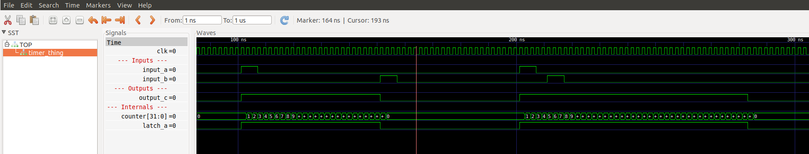

What is this
===

A simple Verilator and Verilog project setup for testing a timer (`timer_thing.sv`). Use this project as a template and starting place for your own Verilator projects!


Running
===
* use `make` to recompile all verilog and run
* use `make quick` to only recompile test-bench cpp files (ignoring any verilog changes) and run
* use `make show` to show your output
* use `make clean` to delete all output files


Files
===
See `hdl/timer_thing.sv`


Example Output
===



gtkwave
===
Used to view wave files.  Install with
```bash
sudo apt-get install gtkwave
```


Verilator
===
This is an opensource simulator for verilog.  You need to have verilator installed (I'm on ubuntu).  Verilator must be installed to `/usr/local/share/verilator` in order for the make scripts to work

Install Verilator on Ubuntu
===

Deps:
```bash
sudo apt-get flex bison autoconf libfl-dev gdb
```

Install:
```bash
cd
git clone http://git.veripool.org/git/verilator
cd verilator
git checkout v4.016
autoconf
./configure
make
make test
sudo make install
```


